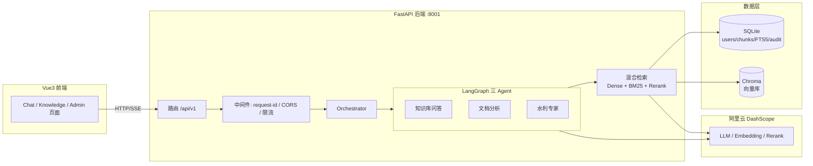

# 水利 RAG + Agent

基于 RAG (检索增强生成) 和 Agent 技术的水利行业知识问答系统。

## 项目特点

- **全云端模型**：使用阿里云 DashScope 服务，无需本地 GPU
- **混合检索**：向量检索 + BM25 稀疏检索 + Rerank 精排，数据隔离按用户
- **三 Agent 架构**：知识库问答 / 指定文档分析 / 水利专家咨询（LangGraph 编排）
- **本地部署**：SQLite + Chroma，数据完全在本地
- **企业级工程化**：RBAC 多用户鉴权、审计日志、限流、预算控制、SSE 流式问答、文档摄取状态机、单元测试 + CI + Docker 一键部署

> **Rerank 降级说明**：Rerank（`gte-rerank`）是可选增强。若账号未开通该模型，
> 系统自动降级为"仅用检索结果"，功能不受影响（`verify_env --all` 会标记 WARN）。
> 可用模型以百炼控制台"模型广场"实际可开通为准。

## 架构



## API 概览

所有业务端点位于 `/api/v1`，均需 `Authorization: Bearer <token>`；`/health` 无需鉴权。

| 方法 | 路径 | 鉴权 | 说明 |
|------|------|------|------|
| POST | `/api/v1/auth/register` | 公开 | 注册（首个用户自动成为管理员） |
| POST | `/api/v1/auth/login` | 公开 | 登录 → token |
| GET | `/api/v1/auth/me` | 用户 | 当前用户信息 |
| POST | `/api/v1/auth/change-password` | 用户 | 修改密码 |
| POST | `/api/v1/chat/stream` | 用户 | SSE 流式问答（检索 → Agent → token 流） |
| POST | `/api/v1/unified-chat/stream` | 用户 | 统一 Agent 入口（流式） |
| POST | `/api/v1/unified-chat/` | 用户 | 统一 Agent 入口（非流式） |
| GET/POST | `/api/v1/documents/` | 用户 | 文档列表 / 上传（异步摄取） |
| GET/PATCH/DELETE | `/api/v1/documents/{id}` | 用户 | 文档详情 / 元数据 / 删除 |
| GET | `/api/v1/threads/` | 用户 | 会话列表 |
| GET/DELETE | `/api/v1/threads/{id}/...` | 用户 | 会话消息 / 删除 |
| POST | `/api/v1/feedback/` | 用户 | 消息反馈（helpful/not_helpful） |
| GET | `/api/v1/admin/*` | 管理员 | 统计 / 用户管理 / 审计 / 导出 |
| GET | `/health` | 公开 | 健康检查 |

## 快速开始

### 环境要求

- Windows 10/11 x64
- Python 3.11.x
- Node.js 20.x LTS
- 16 GB 内存（建议）
- 20 GB SSD 可用空间（建议）

### 本地开发（推荐）

1. 克隆项目
```bash
git clone <repository-url> C:\water-rag-local
cd C:\water-rag-local
```

2. 创建虚拟环境并安装依赖
```bash
py -3.11 -m venv .venv
.venv\Scripts\python.exe -m pip install --upgrade pip
.venv\Scripts\python.exe -m pip install -r requirements.lock.txt
```

3. 配置环境变量
```bash
copy .env.example .env
# 编辑 .env 文件，填写 DashScope API Key
```

4. 一键启动（后端 8001 + 前端 5173）
```bash
start_dev.bat
```

### Docker 部署（生产形态）

```bash
# 首次构建较慢（pip/npm 走国内镜像，见 Dockerfile/.npmrc）
docker compose up -d --build
# 前端 http://localhost:80 ，后端 http://localhost:8001
```

> Docker 排障记录：若 `docker compose up` 卡住，多为 frontend 镜像 `npm ci`
> 走官方源所致，本项目已内置 `frontend/.npmrc`（npmmirror）规避。详见 `docs/enterprise-optimization-plan.md`。

### 备份与定时任务

数据备份会自动校验（`PRAGMA integrity_check` + Chroma 非空）并按保留天数清理旧备份，默认保留 7 天：

```bash
# 手动备份（带备注）
python -m scripts.backup_data --note pre-upgrade
# 指定保留天数（默认取 settings.BACKUP_RETENTION_DAYS）
python -m scripts.backup_data --retention-days 14
```

定时备份用 `scripts/backup_cron.py`，由 `BACKUP_ENABLED`（默认 true）控制开关：

```bash
# Windows 计划任务 / 系统 cron 每日触发一次
python -m scripts.backup_cron --once
# 常驻进程每 3 小时备份一次（docker sidecar / systemd / NSSM）
python -m scripts.backup_cron --interval-hours 3
```

> Windows 计划任务示例：`schtasks /Create /SC DAILY /ST 02:00 /TN "water-rag-backup" /TR "cd /d <项目根目录> && .venv\Scripts\python -m scripts.backup_cron --once"`
> Docker 定时备份：`docker run -d --name water-backup-cron -v water-data:/app/data <镜像> python -m scripts.backup_cron --interval-hours 3`

## 测试与 CI

```bash
# 后端单测（60+ 用例，mock 掉云端，无需 API Key）
.venv\Scripts\python.exe -m pytest
# 覆盖率
.venv\Scripts\python.exe -m pytest --cov=backend --cov-report=term-missing
# 冒烟（需要真实 DashScope Key）
.venv\Scripts\python.exe -m scripts.smoke_test
```

CI（`.github/workflows/ci.yml`）在 push/PR 时自动跑：后端 pytest（覆盖率≥70%）、ruff lint + format、前端 type-check + build。

## 项目结构

```
water-rag-local/
├── backend/              # FastAPI 后端
│   ├── api/              # REST/SSE 接口
│   ├── core/             # 公共核心（安全/限流/预算/审计/SSE）
│   ├── rag/              # RAG 管线（检索/重排/引用/摄取）
│   ├── db/               # 数据库（连接/迁移）
│   ├── schemas/          # Pydantic 数据契约
│   ├── tasks/            # 摄取任务
│   └── agents/           # LangGraph Agent
├── frontend/             # Vue3 + TS + Pinia 前端
├── scripts/              # 初始化/备份/评测/冒烟脚本
├── tests/                # 单元测试（tests/unit）
├── docs/                 # 设计/优化文档
└── data/                 # 运行时数据（勿提交 Git）
```

## 文档

- [企业级优化方案（差距→改法→验证）](docs/enterprise-optimization-plan.md)
- [优化方案 v1（已落地）](docs/optimization-plan.md)

## 许可证

私有项目，未经授权禁止使用和分发。
