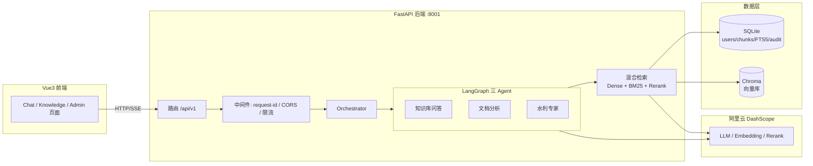

# 架构

水利行业 RAG + Agent 知识问答系统的整体架构与技术决策。

## 总览



## 核心组件

| 组件 | 路径 | 职责 |
|------|------|------|
| FastAPI 应用 | `backend/main.py` | 路由挂载、中间件、OpenAPI |
| 编排器 | `backend/core/orchestrator.py` | Agent 选择、pipeline 模式、状态注入 |
| 三 Agent | `backend/agents/*` | 知识库问答 / 文档分析 / 水利专家（LangGraph StateGraph） |
| RAG 管线 | `backend/rag/` | 检索 / 精排 / 引用核实 / 文档摄取 |
| 模型工厂 | `backend/core/model_factory.py` | LLM 统一入口（重试、超时、流式 usage） |
| 数据层 | `backend/db/` | SQLite 连接池、迁移、FTS5 |
| 任务层 | `backend/tasks/` | 摄取任务持久化队列（崩溃可恢复） |
| 前端 | `frontend/` | Vue3 + TypeScript + Pinia，SSE 流式消费 |

## 请求生命周期（知识库问答）

1. **认证**：`Authorization: Bearer <JWT>` → `get_current_user` 解析，用户隔离贯穿全链路。
2. **限流**：每用户每分钟 `RATE_LIMIT_PER_MINUTE` 次（可插拔后端：内存 / Redis）。
3. **编排**：`Orchestrator.handle(AgentRequest)` 按 `agent_type` 路由到对应 LangGraph 图。
4. **检索**：Dense（Embedding → Chroma）+ BM25（SQLite FTS5）混合 → 加权融合 → Rerank 精排 → Top-K。
5. **生成**：Agent 逐 token 流式回调 → SSE 推送；`UsageCollector` 同链收集 token 用量。
6. **落库**：消息持久化 + LLM 用量记账（`/admin/usage` 聚合展示）。
7. **引用核实**：RAG 回复携带 citation verdict，标注哪些引用真实支撑了答案（防幻觉）。

## 检索管线

```
用户查询
  → 多查询改写（MAX_MULTI_QUERIES 路）
  → 向量召回（Chroma, Dense_TOP_K）      DENSE_WEIGHT
  → BM25 召回（SQLite FTS5, BM25_TOP_K） SPARSE_WEIGHT
  → 加权融合（RRF 风格）
  → Rerank 精排（RERANK_TOP_K，可选；账号未开通自动降级为直接用融合结果）
  → 组装上下文注入 Agent
```

权重与参数在 `backend/config.py`（`DENSE_WEIGHT` / `SPARSE_WEIGHT` / `RERANK_TOP_K` 等），可在 `.env` 调优。

## 数据层

- **SQLite**（`backend/db/`）：用户、消息、chunk、FTS5 索引、审计日志、LLM 用量、摄取任务表。连接池化（`DB_POOL_SIZE`），迁移框架带 `migration_log` 审计与降级路径。
- **Chroma**（`backend/rag/vector_store`）：向量库，Embedding 模型 `text-embedding-v3`，维度 `EMBEDDING_DIM`。同步调用已移出事件循环（G4.3），避免阻塞请求。
- **数据隔离**：所有业务查询按 `user_id` 过滤（消息、文档、thread、用量），多用户数据互不可见。

## SSE 事件契约

流式端点统一按 SSE 事件推送，事件字段 `event` + `data`（JSON）：

| 事件 | data 字段 | 含义 |
|------|-----------|------|
| `start` | `{ thread_id }` | 会话开始 |
| `status` | `{ phase }` | 阶段变更（processing 等） |
| `token` | `{ delta }` | 增量文本片段（客户端拼接） |
| `citation_verdict` | `{ verdict }` | 引用核实结论（chat/stream，防幻觉） |
| `done` | `{ message_id }` | 完成（携带持久化消息 ID） |
| `error` | `{ code, message }` | 错误终止 |

## 可插拔后端

限流 / 日预算计数抽象为统一接口，`REDIS_URL` 留空用进程内实现（单实例默认），配置后切 Redis（多实例共享计数）。参见 [部署](deployment.md)。

## 相关文档

- [API 契约](api.md)
- [部署与运维](deployment.md)
- [安全设计](security.md)
- [开发指南](development.md)
